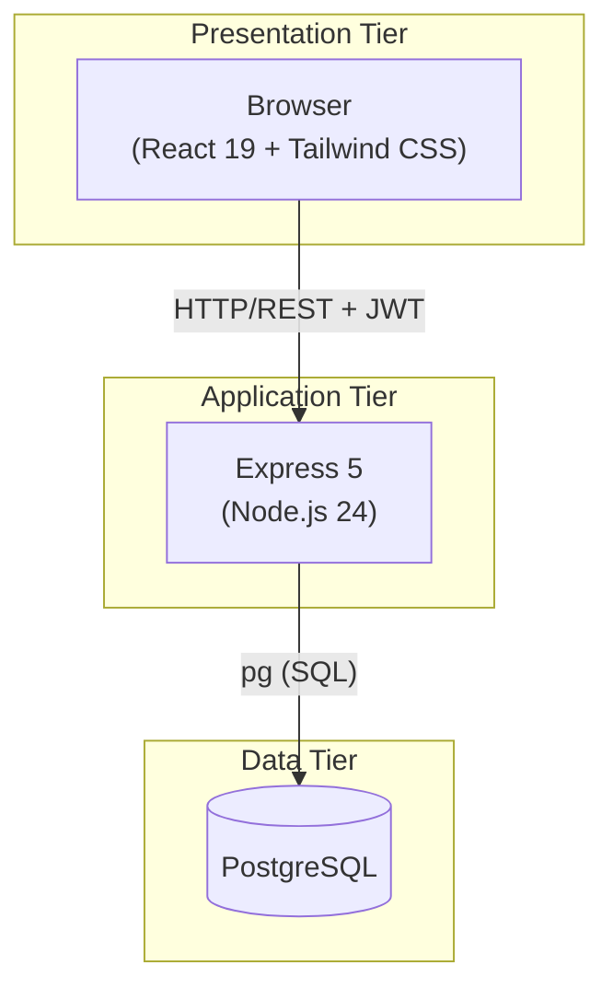
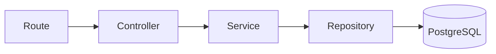
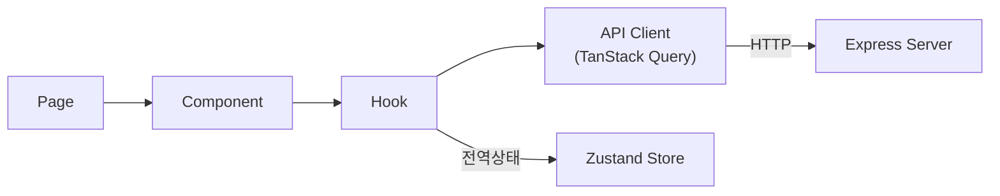
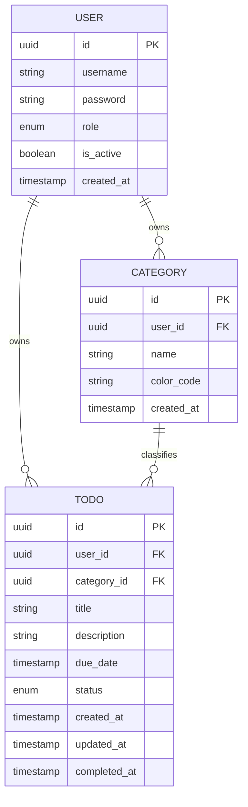
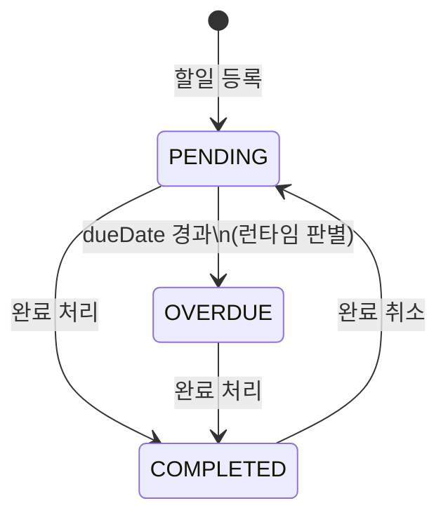
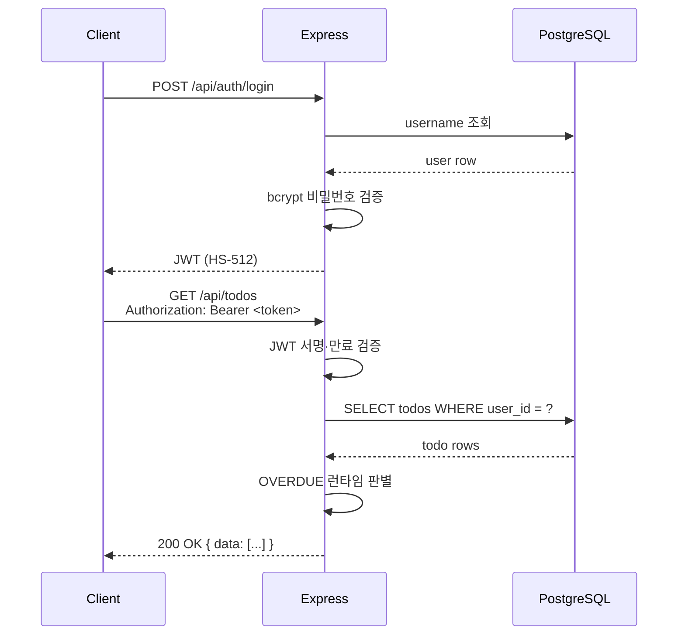

# TodoList 기술 아키텍처 다이어그램

> 버전: 1.0.0 | 작성일: 2026-04-28 | 작성자: chpark

---

## 변경이력

| 버전 | 변경일 | 작성자 | 변경 유형 | 변경 내용 |
|------|--------|--------|-----------|-----------|
| 1.0.0 | 2026-04-28 | chpark | 최초 작성 | 아키텍처 다이어그램 초안 작성 |

---

## 1. 시스템 전체 구조 (3-Tier)

---

## 2. 백엔드 레이어 구조

> 의존 방향은 단방향. 레이어 건너뛰기 금지.

---

## 3. 프론트엔드 레이어 구조

---

## 4. 도메인 모델 (ERD)

---

## 5. 할일 상태 전이

> OVERDUE 는 DB에 저장되지 않으며, 서버가 응답 시 `dueDate` vs 현재 시각으로 런타임 판별한다.

---

## 6. 인증 흐름 (JWT)

---

*본 문서는 PRD(2-prd.md v1.0.0) 및 설계 원칙(4-architecture-principles.md v1.1.0)을 기반으로 한다.*
