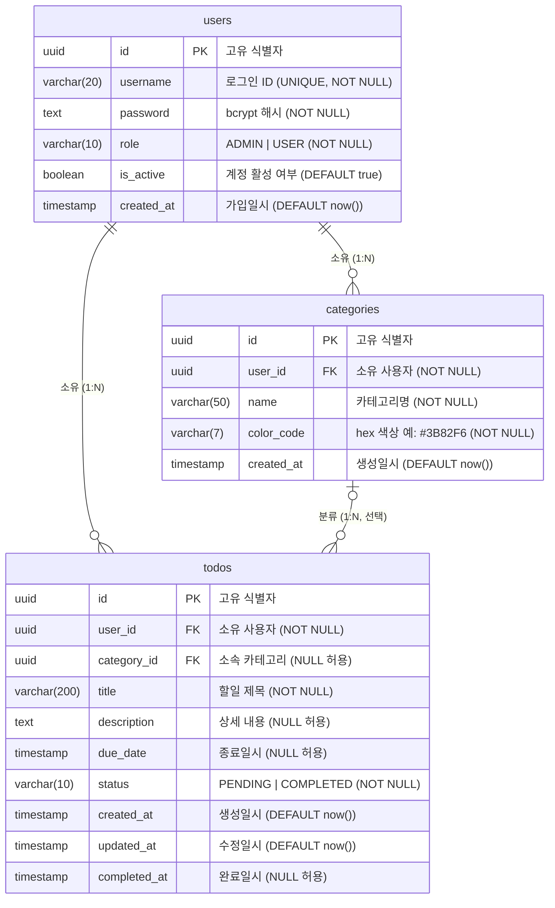

# TodoList ERD (Entity Relationship Diagram)

> 버전: 1.0.0 | 작성일: 2026-04-28 | 작성자: chpark

---

## 변경이력

| 버전 | 변경일 | 작성자 | 변경 유형 | 변경 내용 |
|------|--------|--------|-----------|-----------|
| 1.0.0 | 2026-04-28 | chpark | 최초 작성 | ERD 초안 작성 |

---

## 1. ERD

---

## 2. 테이블 제약조건 상세

### users

| 컬럼 | 타입 | 제약조건 | 기본값 |
|------|------|---------|--------|
| id | UUID | PK | `gen_random_uuid()` |
| username | VARCHAR(20) | NOT NULL, UNIQUE | — |
| password | TEXT | NOT NULL | — |
| role | VARCHAR(10) | NOT NULL, CHECK IN ('ADMIN','USER') | `'USER'` |
| is_active | BOOLEAN | NOT NULL | `true` |
| created_at | TIMESTAMP | NOT NULL | `now()` |

### categories

| 컬럼 | 타입 | 제약조건 | 기본값 |
|------|------|---------|--------|
| id | UUID | PK | `gen_random_uuid()` |
| user_id | UUID | NOT NULL, FK → users.id | — |
| name | VARCHAR(50) | NOT NULL | — |
| color_code | VARCHAR(7) | NOT NULL | — |
| created_at | TIMESTAMP | NOT NULL | `now()` |

- UNIQUE (user_id, name) — 동일 사용자 내 카테고리명 중복 불가

### todos

| 컬럼 | 타입 | 제약조건 | 기본값 |
|------|------|---------|--------|
| id | UUID | PK | `gen_random_uuid()` |
| user_id | UUID | NOT NULL, FK → users.id | — |
| category_id | UUID | NULL 허용, FK → categories.id | `NULL` |
| title | VARCHAR(200) | NOT NULL | — |
| description | TEXT | NULL 허용 | `NULL` |
| due_date | TIMESTAMP | NULL 허용 | `NULL` |
| status | VARCHAR(10) | NOT NULL, CHECK IN ('PENDING','COMPLETED') | `'PENDING'` |
| created_at | TIMESTAMP | NOT NULL | `now()` |
| updated_at | TIMESTAMP | NOT NULL | `now()` |
| completed_at | TIMESTAMP | NULL 허용 | `NULL` |

- categories 삭제 시 → todos.category_id `SET NULL` (할일 보존)

---

## 3. 설계 결정 사항

| 항목 | 결정 | 이유 |
|------|------|------|
| OVERDUE 상태 | DB 컬럼 미저장 | status CHECK에서 OVERDUE 제외. 서버 응답 시 `due_date < now()` AND `status = 'PENDING'` 으로 런타임 판별 |
| categories 삭제 | SET NULL | todos 데이터 보존 (BR-05) |
| username 유일성 | UNIQUE 인덱스 | 시스템 전체 유일 (BR-11) |
| 카테고리명 유일성 | UNIQUE (user_id, name) | 사용자 내 유일, 사용자 간 독립 (BR-06) |
| 기본키 타입 | UUID | 순차 ID 예측 공격 방지 |

---

*본 문서는 도메인 정의서(1-domain-definition.md v1.1.0) 및 설계 원칙(4-architecture-principles.md v1.1.0)을 기반으로 작성되었다.*
